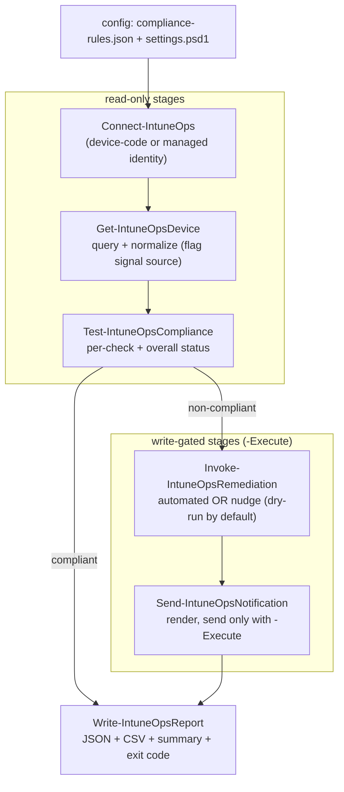

# IntuneOps: Automated Device Compliance and Remediation Workflow


IntuneOps is a PowerShell 7 automation workflow that evaluates Intune-managed devices against
data-driven compliance rules, remediates or nudges based on per-rule policy, notifies affected
users through Graph Mail, and produces a structured run report. It runs interactively for local
development (device-code auth) and unattended as an Azure Automation runbook (managed identity).

Design tenets:
- Read-first, write-gated. Nothing mutates tenant state without an explicit `-Execute` flag.
- Data-driven. Thresholds and per-rule remediation actions live in config, not in code.
- One auth abstraction. The same pipeline runs under device-code (local) and managed identity
  (Automation).
- Honest signals. When the tenant cannot surface a signal (antivirus health is the usual gap),
  the result is flagged `Unknown`, never silently passed or failed.

## Validation approach: mocked Microsoft Graph surface

IntuneOps was developed and validated against a mocked Microsoft Graph surface: device payloads
that match the documented `managedDevices` schema, shipped as JSON fixtures under
`tests/fixtures/managedDevices/`. This mirrors standard practice, where automation logic is
proven against fixtures before touching live tenant state, and reflects a deliberate decision to
avoid a paid licensing commitment for a portfolio project (the free developer-tenant routes have
been retired or paywalled; see [LIMITATIONS.md](LIMITATIONS.md) for the specifics).

The code is live-ready, not live-limited. The only mocked component is the source of
managed-device data: one explicit switch (`-GraphDataSourceMock`) selects it, and everything
downstream (the device model, evaluator, remediation planner, notifier, reporter) is the same
code either way. The auth abstraction and the dry-run / `-Execute` gating mean the same pipeline
runs unchanged against a live tenant when one is available.

Run the full pipeline offline, dry-run, with one flag:

```powershell
./scripts/Invoke-ComplianceScan.ps1 -GraphDataSourceMock
```

There is also a browser demo of the same run: a static page with one button that triggers the
pipeline live in an HTTP-triggered Azure Function (mock data, permanently dry-run, structurally
incapable of reaching `-Execute`). See [demo/README.md](demo/README.md).

## What it does

1. Connects to Microsoft Graph using the resolved auth path.
2. Queries Intune managed devices and normalizes them into a stable device model.
3. Evaluates each device against three checks: disk encryption, OS version (per platform), and
   antivirus health.
4. For non-compliant devices, either creates and assigns an Intune proactive remediation script
   (automated path) or flags the device for a user nudge (nudge path), selectable per rule.
5. Renders and (optionally) sends a templated compliance email to the affected user.
6. Writes a JSON report and a flat CSV projection from a single canonical result object, plus a
   per-run summary.

Every state-changing stage is a dry-run by default and requires `-Execute` to act.

## Architecture



## Repository layout

```
IntuneOps/
  PLAN.md                              Architecture and phased build plan (decisions recorded).
  README.md                            This file.
  LIMITATIONS.md                       Mocked-Graph validation approach: what is mocked, why, and what is not.
  .gitignore                           Keeps secrets, local overrides, and run artifacts out of git.
  .env.example                         Template of local environment variables (copy to .env).
  config/
    compliance-rules.json              Data-driven thresholds + per-rule remediation actions.
    settings.example.psd1              Non-sensitive runtime settings template.
    remediation-scripts/
      Detect-BitLocker.ps1             Sample proactive remediation detection script.
      Remediate-BitLocker.ps1          Sample proactive remediation fix script.
  src/IntuneOps/
    IntuneOps.psd1                     Module manifest.
    IntuneOps.psm1                     Loader: dot-sources Private then Public; holds scope sets.
    Public/                            Exported functions (one per pipeline stage).
    Private/                           Internal helpers (auth, config, checks, Graph calls, render).
  scripts/
    Invoke-ComplianceScan.ps1          Local entrypoint (device-code by default).
  runbooks/
    Start-IntuneOpsRunbook.ps1         Azure Automation entrypoint (managed identity).
  demo/
    function/                          HTTP-triggered Azure Function: runs the pipeline in mock dry-run.
    web/                               Static demo page (Cloudflare Pages) with the run button.
    README.md                          Demo setup: CORS, deploy, cache purge, key trade-off.
  templates/
    notification.text.template         Plain-text email template (tokenized).
    notification.html.template         HTML email template (tokenized).
  tests/                               Pester 5 tests (compliance, remediation, notify, report, mock source).
    fixtures/managedDevices/           Mock managedDevices payloads (Graph v1.0 schema; synthetic data).
  docs/
    architecture.md                    Expanded notes.
    sample-output/                     Redacted sample report.
  logs/                                Run logs (git-ignored except .gitkeep).
```

## Prerequisites

- PowerShell 7.0 or later (`pwsh`).
- Pester 5+ to run the tests: `Install-Module Pester -MinimumVersion 5.0.0 -Scope CurrentUser`.
- For the offline mock mode and the test suite: nothing else. No Graph SDK, no tenant.
- For live runs only: the Microsoft Graph PowerShell SDK modules `Microsoft.Graph.Authentication`
  and `Microsoft.Graph.DeviceManagement`, plus an Intune-enabled tenant (see next section).
  ```powershell
  Install-Module Microsoft.Graph.Authentication -Scope CurrentUser
  Install-Module Microsoft.Graph.DeviceManagement -Scope CurrentUser
  ```
- For unattended runs: an Azure subscription with an Azure Automation account.

## Lab setup: a tenant with Intune (live path, optional)

The project runs and is fully validated without a tenant (see
[Validation approach](#validation-approach-mocked-microsoft-graph-surface) and
[LIMITATIONS.md](LIMITATIONS.md)). The steps below document how to stand up a lab tenant when one
is available. Note that the free routes have narrowed: the M365 Developer Program sandbox now
requires Visual Studio Enterprise eligibility, and the 30-day Intune trial requires a payment
card and provisions a separate tenant.

1. Join the Microsoft 365 Developer Program at https://developer.microsoft.com/microsoft-365/dev-program.
   Sign in with a Microsoft account and complete the profile.
2. Set up the instant sandbox. Choose the configurable or instant sandbox; the program provisions a
   tenant of the form `yourname.onmicrosoft.com` with 25 E5 developer licenses. Record the admin
   UPN and password.
3. Sign in to the Microsoft 365 admin center (https://admin.microsoft.com) as the tenant admin.
4. Assign an E5 (or EMS) license that includes Intune to at least your admin user and any test
   users. Users, then Active users, then select a user, then Licenses and apps.
5. Open the Microsoft Intune admin center (https://intune.microsoft.com). The first visit finalizes
   Intune provisioning for the tenant. If prompted, set the MDM authority to Intune (modern tenants
   default to this).
6. Create one or two test users (Users, then Active users, then Add a user) so notifications have
   real recipient UPNs. Give them mailboxes by assigning a licensed plan with Exchange Online.
7. Enroll or simulate devices:
   - Real enrollment: on a Windows 11 test VM, Settings, then Accounts, then Access work or school,
     then Connect, then join the tenant. The device appears under Devices, then All devices in a few
     minutes.
   - If you cannot enroll a real device, the code still runs and degrades gracefully against a small
     or empty device set. Signals that the tenant does not populate are flagged `Unknown`.

Result: a tenant id, an admin UPN, at least one licensed test user with a mailbox, and zero or more
managed devices.

## Authentication paths

IntuneOps resolves auth in one place (`Resolve-IntuneOpsAuth`) and connects in one place
(`Connect-IntuneOps`). The rest of the pipeline is identical regardless of path.

### Primary path: Azure Automation managed identity (secretless)

This is the recommended unattended path. There is no secret to store or rotate.

1. Create an Azure Automation account (Azure portal, then Create a resource, then Automation).
2. Enable its system-assigned managed identity: Automation account, then Identity, then System
   assigned, then Status On. Copy the Object (principal) ID shown here.
3. Grant Microsoft Graph application permissions to that identity. A managed identity cannot be
   consented through the app registration UI, so you assign Graph app roles directly to its service
   principal. Run this once from a workstation with directory-admin rights:

   ```powershell
   Connect-MgGraph -Scopes 'Application.ReadWrite.All','AppRoleAssignment.ReadWrite.All','Directory.Read.All'

   # Object (principal) ID of the Automation account managed identity, from step 2.
   $miObjectId = '<managed-identity-object-id>'

   # Microsoft Graph resource service principal (well-known appId).
   $graphSp = Get-MgServicePrincipal -Filter "appId eq '00000003-0000-0000-c000-000000000000'"

   # Least-privilege role set. Include only the phases you will run.
   $roleValues = @(
       'DeviceManagementManagedDevices.Read.All'      # Phase 1
       'DeviceManagementConfiguration.Read.All'       # Phase 1
       'DeviceManagementConfiguration.ReadWrite.All'  # Phase 2 (only if remediating)
       'Mail.Send'                                    # Phase 3 (only if sending mail)
   )

   foreach ($value in $roleValues) {
       $appRole = $graphSp.AppRoles | Where-Object { $_.Value -eq $value -and $_.AllowedMemberTypes -contains 'Application' }
       if (-not $appRole) { Write-Warning "Role '$value' not found on Graph SP."; continue }
       New-MgServicePrincipalAppRoleAssignment `
           -ServicePrincipalId $miObjectId `
           -PrincipalId        $miObjectId `
           -ResourceId         $graphSp.Id `
           -AppRoleId          $appRole.Id
       Write-Host "Granted $value"
   }
   ```

   Resolving the role by `Value` (rather than pasting a GUID) avoids copy-paste errors and documents
   intent. The role assignment can take a few minutes to propagate.
4. In the runbook, `Connect-IntuneOps -AuthMode ManagedIdentity` calls `Connect-MgGraph -Identity`.
   No scopes are passed for app-only auth: the permissions are the app roles you just assigned.

### Local development path: device code (no secret)

For local runs, device-code auth uses the Microsoft Graph PowerShell first-party app and prompts you
to sign in with a browser. Delegated read scopes are requested (write scopes only if you pass
`-Execute`).

```powershell
$env:INTUNEOPS_TENANT_ID = '<your-tenant-id>'   # optional; speeds up sign-in
./scripts/Invoke-ComplianceScan.ps1 -AuthMode DeviceCode
```

### Fallback path: app registration + certificate + Key Vault

Documented for completeness; prefer managed identity. Use this only when a managed identity is not
available.

1. Register an application (Entra admin center, then App registrations, then New registration).
2. Under API permissions, add the Microsoft Graph application permissions for the phases you need
   (see the scope table below), then Grant admin consent.
3. Create or upload a certificate (Certificates and secrets, then Certificates). Store the private
   key in Azure Key Vault; never commit it.
4. Provide identifiers via environment variables locally, or via Azure Automation variables and a
   Key Vault reference unattended. Set `INTUNEOPS_AUTH_MODE=AppCertificate`, `INTUNEOPS_CLIENT_ID`,
   `INTUNEOPS_TENANT_ID`, and `INTUNEOPS_CERT_THUMBPRINT`.

## Required Graph scopes (least privilege, by phase)

Scopes are requested only for the stages that actually run. Read scopes come first; write scopes are
added only when `-Execute` is used.

### Phase 1: read-only (always)

| Scope | Justification |
|-------|---------------|
| `DeviceManagementManagedDevices.Read.All` | List managed devices and read compliance-relevant properties (OS version, `isEncrypted`, ownership, protection state). |
| `DeviceManagementConfiguration.Read.All` | Read existing policies and proactive remediation scripts (needed for Phase 2 idempotency; harmless read in Phase 1). |

Owner email comes from the device object's `userPrincipalName`, so `User.Read.All` and
`Directory.Read.All` are deliberately not requested.

### Phase 2: remediation (only with `-Remediate -Execute`)

| Scope | Justification |
|-------|---------------|
| `DeviceManagementConfiguration.ReadWrite.All` | Create and assign Intune proactive remediation scripts (`deviceHealthScripts`). Minimum scope that covers create plus assign. |

`DeviceManagementManagedDevices.PrivilegedOperations.All` is deliberately not requested. On-demand
per-device triggering is out of scope for v1 (see Known limitations and Future extensions).

### Phase 3: notifications (only with `-Notify -Execute`)

| Scope | Justification |
|-------|---------------|
| `Mail.Send` | Send compliance notification emails via Graph Mail. Constrain the sender with an application access policy (see Security trade-offs). |

## Configuration

- `config/compliance-rules.json`: enable or disable checks, set per-platform minimum OS versions,
  and choose each check's `action` (`Automated` or `Nudge`). Automated checks carry a `remediation`
  block that points at the detection and fix scripts and the assignment target. Change policy here,
  not in code.
- `config/settings.example.psd1`: copy to `config/settings.psd1` and set `AuthMode`, `MailSender`,
  `UseHtmlEmail`, and paths. Only non-sensitive values live here.
- `.env.example`: copy to `.env` (git-ignored) for local identifiers. Secrets never belong in the
  repo.

## Running offline (mock mode)

The full pipeline, end to end, with no tenant, no Graph SDK, and no sign-in. Devices come from
the shipped fixtures; remediation and notification stages default ON in dry-run so one flag
demonstrates everything, and nothing is mutated:

```powershell
./scripts/Invoke-ComplianceScan.ps1 -GraphDataSourceMock
```

Point it at your own fixture file (a Graph-style `{ "value": [ ... ] }` list response or a bare
JSON array of `managedDevice` objects):

```powershell
./scripts/Invoke-ComplianceScan.ps1 -GraphDataSourceMock -FixturePath ./tests/fixtures/managedDevices/managedDevices.mock.json
```

Mock mode never fakes authentication. A mock dry-run makes zero Graph calls, so no session is
established and no scope is requested. Combining `-GraphDataSourceMock` with `-Execute` still
signs in for real (device-code, honouring `INTUNEOPS_TENANT_ID`), because remediation and mail
send are live writes regardless of where the device data came from.

## Running locally (device code)

Read-only scan (default: no writes, no mail):

```powershell
./scripts/Invoke-ComplianceScan.ps1
```

Scan plus remediation and notifications in dry-run (still nothing changes, no write scopes
requested):

```powershell
./scripts/Invoke-ComplianceScan.ps1 -Remediate -Notify
```

Apply for real (requests the write scopes, creates and assigns remediation, sends mail):

```powershell
./scripts/Invoke-ComplianceScan.ps1 -Remediate -Notify -Execute
```

Preview a real run without changing anything, per action:

```powershell
./scripts/Invoke-ComplianceScan.ps1 -Remediate -Notify -Execute -WhatIf
```

Key parameters: `-Platform`, `-MaxDevices`, `-MailSender`, `-UseHtml`, `-OutputPath` (JSON),
`-CsvPath`, `-LogPath`. Exit codes: 0 all compliant, 1 non-compliant present, 2 some signals
unknown, 3 fatal (auth or config).

## Deploying as an Azure Automation runbook

1. Create the Automation account and enable its managed identity, then grant Graph app roles (see
   Primary path above).
2. Import the Graph modules into the Automation account: Automation account, then Modules, then Add a
   module (browse the gallery for `Microsoft.Graph.Authentication` and
   `Microsoft.Graph.DeviceManagement`). Use PowerShell 7 runtime.
3. Stage the project so the runbook can import the module. Either package `src/IntuneOps` as a custom
   module and import it, or lay down the repo and let the runbook fall back to the relative path.
4. Create the runbook: Automation account, then Runbooks, then Create a runbook (PowerShell 7.x),
   and paste `runbooks/Start-IntuneOpsRunbook.ps1`. Publish it.
5. Set Automation variables to control behavior (all optional; defaults are safe dry-run):
   - `IntuneOps-Execute` (`true`/`false`, default `false`)
   - `IntuneOps-Remediate` (`true`/`false`, default `true`)
   - `IntuneOps-Notify` (`true`/`false`, default `true`)
   - `IntuneOps-MailSender` (sender UPN)
   A freshly imported runbook changes nothing until `IntuneOps-Execute` is set to `true`.
6. Schedule it: Runbook, then Schedules, then Add a schedule (for example daily). The run summary is
   emitted to the job output and the reports are written to the sandbox temp directory.

## Dry-run demo walkthrough (mock mode output)

The pipeline exercised end to end, offline, with `./scripts/Invoke-ComplianceScan.ps1
-GraphDataSourceMock`. The four fixture devices cover every check and both remediation paths.
Notice the antivirus `Unknown` flag flowing through honestly: `MOCK-WIN-NOAV` carries no
`windowsProtectionState`, so the signal is `Unavailable` and the check resolves to `Unknown`
(governed by `treatUnknownAs`), never a silent pass.

Connect stays honest (no fake session; nothing on this path calls Graph):

```
[INFO   ] IntuneOps starting: scan(MOCK devices) + remediate(dry-run) + notify(render).
[INFO   ] Mock dry-run: devices come from fixtures and no stage will call Graph, so no Graph
          session is established and no scope is requested.
[INFO   ] Loaded 4 mock device(s) from fixture: ...\tests\fixtures\managedDevices\managedDevices.mock.json
WARNING: MOCK data source in use: managed devices are fixtures, not live Graph data.
```

Evaluate:

```
DeviceName     Platform OsVersion       OverallStatus FailingChecks
----------     -------- ---------       ------------- -------------
MOCK-WIN-OK    Windows  10.0.22631.3958 Compliant
MOCK-WIN-NOENC Windows  10.0.22631.3958 NonCompliant  DiskEncryption
MOCK-MAC-OLDOS macOS    13.5            NonCompliant  OSVersion
MOCK-WIN-NOAV  Windows  10.0.22631.3958 Unknown
```

Remediate (dry-run, nothing changes):

```
[INFO   ] Remediation stage: 2 planned action(s). Mode=DryRun.
WARNING: DRY-RUN: no tenant state will be changed. Re-run with -Execute to apply.
[INFO   ] WOULD ensure proactive remediation 'IntuneOps - Enable BitLocker (OS volume)' -> assign
          to AllDevices exists and is assigned; detection='...Detect-BitLocker.ps1',
          remediation='...Remediate-BitLocker.ps1', runAs=system, affects 1 device(s).
[INFO   ] WOULD nudge 'MOCK-MAC-OLDOS' (owner chloe.martin@contoso.onmicrosoft.com) for
          OSVersion: OS version 13.5 is below minimum 14.0.

Kind      Check          Target                                   Result               AffectedDeviceCount
----      -----          ------                                   ------               -------------------
Automated DiskEncryption IntuneOps - Enable BitLocker (OS volume) WouldCreateAndAssign                   1
Nudge     OSVersion      MOCK-MAC-OLDOS                           WouldNudge                             1
```

Notify (rendered, unsent):

```
Device         To                                     ContentType Result
------         --                                     ----------- ------
MOCK-WIN-NOENC bruno.tremblay@contoso.onmicrosoft.com Text        Rendered
MOCK-MAC-OLDOS chloe.martin@contoso.onmicrosoft.com   Text        Rendered
```

Report summary and the flat CSV projection (same canonical object; antivirus `Unknown` preserved):

```
Run summary
  Devices: 4 total | 1 compliant | 2 non-compliant | 1 unknown
  Remediation: 2 planned | 0 applied | 2 simulated | 0 skipped | 0 failed
  Notifications: 2 total | 0 sent | 2 rendered | 0 skipped | 0 failed
```

```
DeviceName,Platform,OverallStatus,DiskEncryption_Status,OSVersion_Status,Antivirus_Status
MOCK-WIN-OK,Windows,Compliant,Compliant,Compliant,Compliant
MOCK-WIN-NOENC,Windows,NonCompliant,NonCompliant,Compliant,Compliant
MOCK-MAC-OLDOS,macOS,NonCompliant,Compliant,NonCompliant,Unknown
MOCK-WIN-NOAV,Windows,Unknown,Compliant,Compliant,Unknown
```

The exit code is 1 (non-compliant devices present: a signal, not an error). The full JSON report
from this run is in `docs/sample-output/compliance-report.sample.json`.

## Known limitations

See [LIMITATIONS.md](LIMITATIONS.md) for the full statement of the mocked-Graph validation
approach: what is mocked (only the managed-device data source), what is not (everything else),
and why. Highlights:

- Antivirus signal gap. Tenants do not always populate `windowsProtectionState`, so the antivirus
  check resolves to `Unknown`. IntuneOps flags this as `Unavailable`/`Unknown` rather than
  guessing. Set `checks.antivirus.treatUnknownAs` to `NonCompliant` if you want unknown treated
  as a failure in your policy.
- Small or empty device inventory. With few or no enrolled devices, stages degrade gracefully and
  report empty results rather than erroring.
- Proactive remediation availability. `deviceHealthScripts` is used against the v1.0 endpoint via raw
  Graph calls because SDK cmdlet coverage varies by module version. Some capabilities differ across
  tenants and licensing.
- On-demand triggering is not implemented. v1 remediation is assignment-only: Intune runs the script
  on its assignment schedule. Per-device immediate triggering would require
  `DeviceManagementManagedDevices.PrivilegedOperations.All` and is a named future extension.

## Security trade-offs

- `Mail.Send` as an application permission can send as any mailbox in the tenant. The tighter
  alternative is an Exchange Online application access policy that restricts the app (or managed
  identity) to sending only as members of a specific mail-enabled security group:
  ```powershell
  Connect-ExchangeOnline
  New-ApplicationAccessPolicy `
      -AppId '<app-or-managed-identity-appId>' `
      -PolicyScopeGroupId 'intuneops-senders@contoso.onmicrosoft.com' `
      -AccessRight RestrictAccess `
      -Description 'IntuneOps may send only as the compliance-bot mailbox.'
  ```
  Apply this before enabling `-Notify -Execute` in production.
- The managed identity's Graph app roles are tenant-wide application permissions (for example
  `DeviceManagementConfiguration.ReadWrite.All`). Grant only the roles for the phases you actually
  run, review them periodically, and remove `Mail.Send` and the ReadWrite role if you operate in
  report-only mode. Prefer the read-only pair when remediation and notification are not needed.
- No secrets in the repo. `.gitignore` excludes `.env`, certificates, local overrides, and run logs.
  The managed identity path stores no secret at all; the fallback path keeps certificate material in
  Key Vault.

## Testing

```powershell
Invoke-Pester -Path ./tests
```

The suite (42 tests) covers the compliance evaluator and each check, the mock device source and
its normalization of the fixtures, the evaluator run directly against the fixtures, the full mock
pipeline in dry-run, the remediation plan builder and its dry-run/execute/`-WhatIf` branches
(Graph mocked), notification rendering and send safety, and the JSON plus CSV report projection.
The pure logic and the whole mock path import and test without the Graph SDK installed.

## Future extensions (scoped out of v1)

- On-demand per-device remediation triggering (needs `PrivilegedOperations.All`).
- Additional checks (firewall, jailbreak/root, encryption cipher strength).
- Delta queries for large tenants.

## License

MIT. See `LICENSE` (add before publishing).
