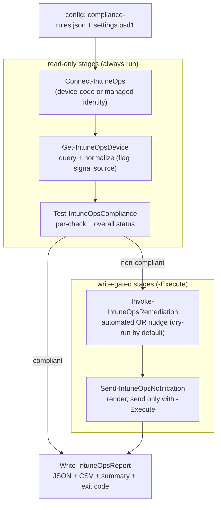

# IntuneOps: Architecture

Expanded architecture notes referenced from the README. This document is the canonical reference for
the pipeline diagram, the device model and compliance result schemas, and the auth decision table.
The README carries the operator-facing narrative (setup, consent, running); this file carries the
internal shapes and contracts a developer needs before changing the code.

## 1. Design tenets

These four rules constrain every stage. Preserve them when changing the code.

- **Read-first, write-gated.** Stages 1 to 3 never mutate tenant state. Stages 4 and 5 are the only
  state-changing stages and are gated by an `-Execute` switch threaded from the entrypoint down. On
  the dry-run path the write scopes are never even requested from Graph, so a dry-run cannot mutate
  state even in principle.
- **Data-driven.** Thresholds and per-rule actions live in `config/compliance-rules.json`, not in
  code. Adding or tuning policy is a config edit; adding a new check is one new `Test-*` Private
  function plus a rules entry.
- **One auth abstraction.** `Resolve-IntuneOpsAuth` is the single decision point; `Connect-IntuneOps`
  is the single connect point. The rest of the pipeline is identical regardless of auth path.
- **Honest signals.** When Graph cannot surface a signal, the check resolves to `Unknown` (governed
  by policy), never a silent pass or fail. Missing signals are labelled `Unavailable` at the source.

## 2. Pipeline (canonical diagram)



Stage-to-function map, with the module functions each stage drives:

| Stage | Public function | Private helpers it drives |
| ------- | ----------------- | --------------------------- |
| 1. Connect | `Connect-IntuneOps` | `Resolve-IntuneOpsAuth`, `Get-IntuneOpsConfig` |
| 2. Query + normalize | `Get-IntuneOpsDevice` | `ConvertTo-IntuneOpsDeviceModel`, `Import-IntuneOpsDeviceFixture` (mock source) |
| 3. Evaluate (pure) | `Test-IntuneOpsCompliance` | `Test-DiskEncryption`, `Test-OSVersion`, `Test-Antivirus` |
| 4. Remediate (gated) | `Invoke-IntuneOpsRemediation` | `Resolve-IntuneOpsRemediationPlan`, `Get-IntuneOpsHealthScript`, `New-IntuneOpsHealthScript`, `Set-IntuneOpsHealthScriptAssignment` |
| 5. Notify (gated) | `Send-IntuneOpsNotification` | `Format-IntuneOpsNotification` |
| 6. Report (always) | `Write-IntuneOpsReport` | `ConvertTo-IntuneOpsReportRow` |

`Write-IntuneOpsLog` is the single logging sink used by every stage.

### Device data sources: live Graph or fixtures

Stage 2 has two raw-data sources behind one function. The default is the live Graph query.
`Get-IntuneOpsDevice -GraphDataSourceMock` instead loads raw `managedDevice` objects from a JSON
fixture file (`Import-IntuneOpsDeviceFixture`; default
`tests/fixtures/managedDevices/managedDevices.mock.json`, override with `-FixturePath`). The
fixture file is shaped like a Graph list response (`{ "value": [ ... ] }`, a bare array also
works) with `windowsProtectionState` embedded inline per device, mirroring the navigation
property the live path reads with a separate per-device call.

The branch ends at the raw read. Both sources feed the identical
`ConvertTo-IntuneOpsDeviceModel` normalization, the same filters, and the same output shape, so
the evaluator, remediation planner, notifier, and reporter are unaware of the data source; the
pipeline is never forked. The mock path requires no Graph SDK and no session and makes zero Graph
calls, which is what lets the whole pipeline run and test offline (see LIMITATIONS.md at the repo
root for why this mode exists and what it does and does not limit).

Authentication is never faked. In the local entrypoint, a mock dry-run establishes no Graph
session at all (no stage will call Graph, so no scope is requested); mock mode combined with
`-Execute` still signs in for real, because remediation create/assign and mail send are live
writes regardless of where the device data came from.

## 3. Data model: normalized device

`ConvertTo-IntuneOpsDeviceModel` flattens a raw Graph `managedDevice` (plus an optional
`windowsProtectionState`) into a stable, platform-agnostic object. The key idea is that each
compliance signal travels with a **source flag** so downstream checks can tell a real reading from a
missing one. Property access is defensive: raw Graph objects can arrive as typed SDK objects or as
hashtables (from `Invoke-MgGraphRequest`), and a missing property yields `$null` rather than a crash.

| Field | Type | Notes |
| ------- | ------ | ------- |
| `DeviceId` | string | Graph `id`. |
| `DeviceName` | string | Graph `deviceName`. |
| `OwnerUpn` | string | Graph `userPrincipalName`. Used as the notification recipient. |
| `OwnerEmail` | string | Graph `emailAddress`. |
| `Platform` | string | Normalized to `Windows` / `macOS` / `iOS` / `Android` / `Unknown` from `operatingSystem`. |
| `OsVersion` | string | Graph `osVersion` (raw string, parsed leniently by the OS check). |
| `IsEncrypted` | bool or `$null` | `$null` when the property is absent from the response. |
| `EncryptionSignalSource` | string | `Graph` when read, `Unavailable` when absent. |
| `AntivirusHealthy` | bool or `$null` | Derived: real-time protection on AND AV enabled AND signatures not overdue. `$null` when no protection state. |
| `AntivirusSignalSource` | string | `Graph` when a `windowsProtectionState` was supplied, else `Unavailable`. |
| `AntivirusDetail` | string | Human-readable breakdown of the three underlying flags, or the "no protection state" note. |
| `ComplianceState` | string | Intune's own `complianceState` (informational; IntuneOps computes its own verdict). |
| `ManagementState` | string | Graph `managementState`. |
| `LastSyncDateTime` | datetime | Graph `lastSyncDateTime`. |
| `Manufacturer` / `Model` | string | Hardware identity. |

### Signal-source values

| Value | Meaning |
| ------- | --------- |
| `Graph` | The signal was actually read from Graph. |
| `Unavailable` | The property or protection state was absent; the check must resolve to `Unknown`. |
| `Config` | (OS check only) the verdict came from configuration, e.g. no minimum set for the platform. |

## 4. Compliance evaluation

`Test-IntuneOpsCompliance` is pure and deterministic: no Graph calls, no I/O. That is what lets the
whole evaluator (and each `Test-*` check) unit-test against synthetic device models on a machine
without the Graph SDK installed.

### Per-check result shape

Every `Test-*` check returns the same shape, so checks are uniform and independently testable:

| Field | Notes |
| ------- | ------- |
| `Check` | `DiskEncryption` / `OSVersion` / `Antivirus`. |
| `Status` | `Compliant` / `NonCompliant` / `Unknown`. |
| `Reason` | Human-readable explanation, surfaced in reports and emails. |
| `SignalSource` | `Graph` / `Unavailable` / `Config` (see above). |
| `Expected` | The value the check wanted (e.g. `$true`, or the minimum version string). |
| `Actual` | The observed value (may be `$null` when the signal was unavailable). |

Per-check logic:

- **DiskEncryption**: `Unknown` if the encryption signal is `Unavailable`; otherwise `Compliant` when
  `IsEncrypted`, else `NonCompliant`.
- **OSVersion**: parses versions leniently (pads `13` or `17.0` to a comparable `[version]`).
  `Unknown` when the platform has no configured minimum or either version cannot be parsed; otherwise
  compares device version against `minimumByPlatform`.
- **Antivirus**: `Unknown` (or whatever `treatUnknownAs` maps it to) when the AV signal is
  `Unavailable`; otherwise `Compliant` / `NonCompliant` from `AntivirusHealthy`.

### Canonical compliance result (the single source of truth)

`Test-IntuneOpsCompliance` emits one of these per device. It is the single object the whole rest of
the run is built from: JSON is a direct serialization of it, CSV is a flat projection of it, and the
remediation/notification stages consume it.

| Field | Notes |
| ------- | ------- |
| `DeviceId`, `DeviceName`, `OwnerUpn`, `Platform`, `OsVersion` | Carried through from the device model. |
| `Checks` | Array of per-check result objects (shape above). |
| `OverallStatus` | Rolled up with precedence `NonCompliant` > `Unknown` > `Compliant`. No enabled checks also yields `Unknown`. |
| `Reasons` | The `[Check] Reason` string for every check that is not `Compliant`. |
| `EvaluatedAt` | ISO-8601 timestamp of the evaluation. |

**Overall status precedence:** any failing check makes the device `NonCompliant`; with no failures
but any unreadable signal it is `Unknown`; only all-`Compliant` checks yield `Compliant`. Disabled
checks are skipped and do not affect the roll-up.

## 5. Remediation (stage 4, write-gated)

`Resolve-IntuneOpsRemediationPlan` is pure (the "what should happen" decision); `Invoke-IntuneOpsRemediation`
executes it (the "make it happen"). Splitting them keeps plan-building unit-testable without Graph.

Per-rule action, selected in `compliance-rules.json`:

- **`Automated`**: ONE aggregate action per check, because an Intune proactive remediation
  (`deviceHealthScript`) is a tenant-level object assigned to a group, not a per-device artifact. The
  action carries the resolved detection/remediation script paths (existence-checked against the repo
  root so a missing script is flagged before any execute run), the assignment target, and the list of
  affected device ids for reporting. If a rule is `Automated` but has no `remediation` block, the plan
  falls back to nudging the affected devices rather than dropping them.
- **`Nudge`**: ONE action per affected device. A nudge never mutates tenant state; the actual email is
  stage 5. In stage 4 it only records the flag.

### Safety model (three layers)

1. **Dry-run is the default.** Without `-Execute`, `Invoke-IntuneOpsRemediation` makes zero
   state-changing Graph calls; it logs the exact target/action/script that would run.
2. **Write scopes are not requested on the dry-run path.** The entrypoint only adds
   `DeviceManagementConfiguration.ReadWrite.All` to the requested scope set when remediation will
   actually execute (`-Remediate -Execute`).
3. **`SupportsShouldProcess`.** Even with `-Execute`, `-WhatIf` short-circuits every write and each
   mutation is individually guarded by `ShouldProcess`. `ConfirmImpact` is `Medium` (not `High`) so an
   unattended Automation `-Execute` run does not deadlock on a confirmation prompt.

The `Automated` execute path is **idempotent**: `Get-IntuneOpsHealthScript` checks for an existing
script by display name and reuses it rather than creating a duplicate, so the workflow is safe to
re-run. Assignment is the trigger (Intune runs the script on its schedule); per-device on-demand
triggering is out of scope for v1 (it would need `DeviceManagementManagedDevices.PrivilegedOperations.All`).

### Remediation outcome record

One per action, consumed by the report summary. `Kind` is `Automated` or `Nudge`; `Mode` is `DryRun`
or `Execute`; `Result` is one of `WouldCreateAndAssign` / `WouldNudge` (dry-run),
`Created+...` / `AlreadyExists+...` / `Flagged` (execute success), `SkippedByWhatIf`, or `Failed`.

## 6. Notification (stage 5, write-gated)

`Send-IntuneOpsNotification` renders the templated email (text or HTML, via
`Format-IntuneOpsNotification`) for each **`NonCompliant`** result and either sends it or, in dry-run,
logs a preview. `Compliant` and `Unknown` results are deliberately not notified: `Unknown` means a
signal could not be read, not a confirmed failure, so the user is not alarmed.

Same safety shape as remediation: dry-run default, `Mail.Send` requested only on `-Notify -Execute`,
and `SupportsShouldProcess` guarding the send. Mail goes out as a raw `Invoke-MgGraphRequest` POST to
`/users/{sender}/sendMail` with `saveToSentItems = false`. The sender is the configured `MailSender`
(app-only) or the signed-in user (delegated); an Exchange Application Access Policy should constrain
the app-only sender in production (see README).

Notification outcome record fields: `To`, `Subject`, `ContentType`, `Mode`, `Result`
(`Rendered` in dry-run; `Sent` / `SkippedByWhatIf` / `SkippedNoRecipient` / `Failed` on execute),
`Device`.

## 7. Reporting and exit codes (stage 6, always runs)

`Write-IntuneOpsReport` serializes the canonical results to JSON directly and projects the same
objects to a flat CSV via `ConvertTo-IntuneOpsReportRow`. There is deliberately no second schema: the
CSV columns (`DiskEncryption_Status`, `OSVersion_Status`, `Antivirus_Status`, per-check `_Reason`,
etc.) are a reshape of the canonical object, indexed by check name so column order is stable
regardless of the `Checks` array order.

It also builds the per-run summary (status counts; remediation applied vs simulated vs skipped vs
failed; notifications sent vs rendered vs skipped vs failed) and returns a recommended exit code.

| Code | Meaning | Set by |
| ------ | --------- | -------- |
| 0 | All evaluated devices compliant. | `Write-IntuneOpsReport` |
| 1 | One or more devices non-compliant (a signal, not an error). | `Write-IntuneOpsReport` |
| 2 | Some signals could not be evaluated (`Unknown` present). | `Write-IntuneOpsReport` |
| 3 | Fatal: auth or config failure; nothing evaluated. | entrypoint `catch` block |

## 8. Auth decision table

`Resolve-IntuneOpsAuth` maps an auth mode to a `Connect-MgGraph` splat and metadata (`Mode`,
`IsAppOnly`, `ConnectSplat`, `Description`). Identifiers are read from parameters first, then
environment variables (`INTUNEOPS_TENANT_ID`, `INTUNEOPS_CLIENT_ID`, `INTUNEOPS_CERT_THUMBPRINT`,
`INTUNEOPS_AUTH_MODE`, `INTUNEOPS_CLIENT_SECRET`). Secrets are converted to a credential object
immediately and never returned as a bare string or logged.

| Mode | App-only | Scopes passed? | Required identifiers | Use |
| ------ | ---------- | ---------------- | ---------------------- | ----- |
| `DeviceCode` | No | Yes (delegated) | none (SDK first-party app; `TenantId` optional to speed sign-in) | Default for local dev. |
| `Interactive` | No | Yes (delegated) | none | Local dev, browser sign-in. |
| `ManagedIdentity` | Yes | No | none | Primary unattended path (Azure Automation), secretless. |
| `AppCertificate` | Yes | No | `ClientId`, `TenantId`, `CertificateThumbprint` | Documented fallback. |
| `AppSecret` | Yes | No | `ClientId`, `TenantId`, `INTUNEOPS_CLIENT_SECRET` | Discouraged; throwaway apps only. |

**Why app-only modes pass no `-Scopes`:** their permissions are pre-consented Graph app roles on the
service principal, so passing scopes is both unnecessary and unsupported. Delegated modes receive the
per-phase scope set composed by the entrypoint.

### Per-phase Graph scopes

The entrypoint composes the requested scope set from what will actually execute. The three scope
arrays live in `IntuneOps.psm1`.

| Phase | Scope(s) | Requested when |
| ------- | ---------- | ---------------- |
| 1 (read-only) | `DeviceManagementManagedDevices.Read.All`, `DeviceManagementConfiguration.Read.All` | Always. |
| 2 (remediation) | + `DeviceManagementConfiguration.ReadWrite.All` | Only on `-Remediate -Execute`. |
| 3 (notification) | + `Mail.Send` | Only on `-Notify -Execute`. |

Owner email comes from the device object's `userPrincipalName`, so `User.Read.All` and
`Directory.Read.All` are deliberately not requested.

## 9. Module loading and state

`IntuneOps.psm1` dot-sources every `Private/*.ps1` then every `Public/*.ps1` (Public functions depend
on Private helpers) and exports the Public function base names plus two operational helpers the thin
entrypoints drive directly: `Write-IntuneOpsLog` and `Get-IntuneOpsConfig` (they stay in `Private/`
because they are infrastructure, not pipeline stages). Convention: one function per file, filename
equals function name. Adding an exported function means adding the file to `Public/` and its name to
`FunctionsToExport` in `IntuneOps.psd1`.

Module-scoped state (`$script:IntuneOpsLogPath`, the three scope arrays, `$script:IntuneOpsModuleRoot`)
lives in the loader, not in individual functions. The log path is set from outside the module by
running a scriptblock in the module's session state:

```powershell
& (Get-Module IntuneOps) { param($p) $script:IntuneOpsLogPath = $p } $LogPath
```

The manifest deliberately does not list `Microsoft.Graph.*` in `RequiredModules` so the pure
evaluation logic imports without the SDK. Graph-calling functions verify SDK availability at call
time instead.

## 10. Entrypoints

Both entrypoints are thin: parse parameters/variables, import the module, call the same Public
functions in the same order, set the exit code. Pipeline logic belongs in the module, not here.

- `scripts/Invoke-ComplianceScan.ps1` (local): device-code auth by default; switches `-Remediate`,
  `-Notify`, `-Execute`, `-WhatIf`, plus filters and output paths. `-GraphDataSourceMock` (with
  optional `-FixturePath`) drives the whole pipeline from the fixtures; in that mode the
  remediation and notification stages default ON in dry-run so one flag demonstrates the full
  pipeline, and a Graph session is established only when a stage will actually call Graph.
- `runbooks/Start-IntuneOpsRunbook.ps1` (Azure Automation): forces managed-identity auth, reads
  `IntuneOps-*` Automation variables (safe dry-run defaults: Remediate+Notify on, Execute off), no
  interactive prompts, always writes a report artifact to the sandbox temp directory.
